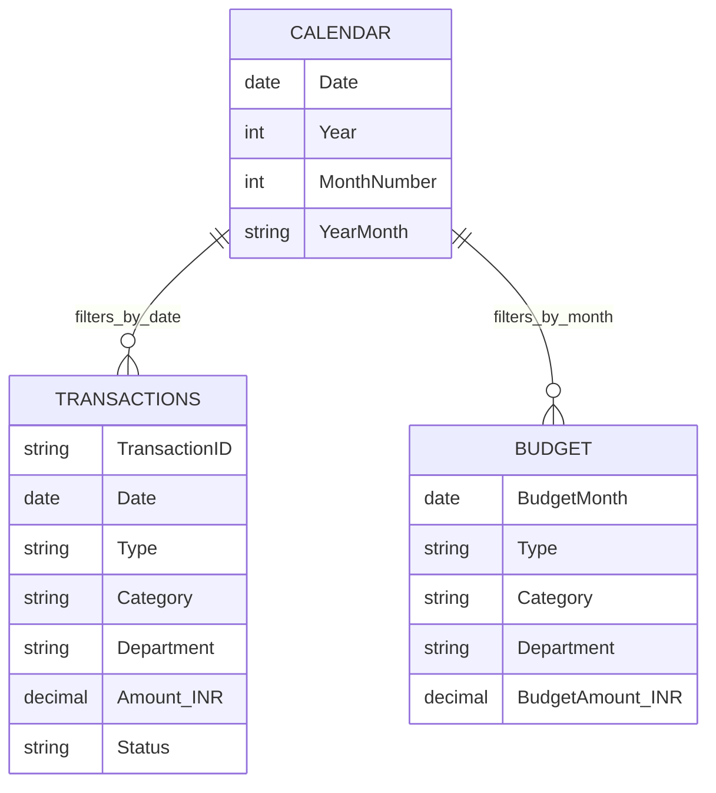

# Relationship Diagram

```mermaid
erDiagram
    CALENDAR ||--o{ TRANSACTIONS : filters_by_date
    CALENDAR ||--o{ BUDGET : filters_by_month
    CALENDAR {
        date Date
        int Year
        int MonthNumber
        string YearMonth
    }
    TRANSACTIONS {
        string TransactionID
        date Date
        string Type
        string Category
        string Department
        decimal Amount_INR
        string Status
    }
    BUDGET {
        date BudgetMonth
        string Type
        string Category
        string Department
        decimal BudgetAmount_INR
    }
```

For a production-quality star schema, add shared `DimCategory` and `DimDepartment` tables and connect each dimension to both Transactions and Budget.
